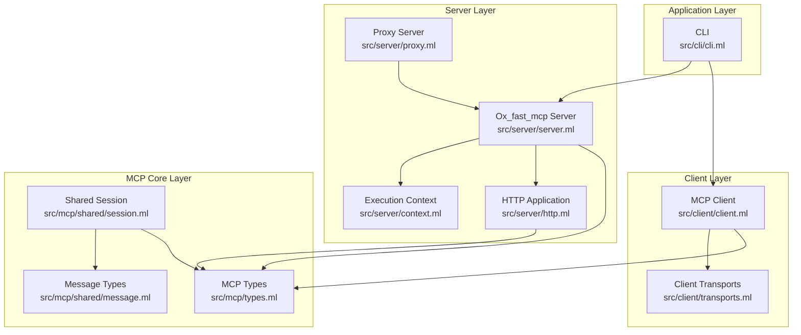
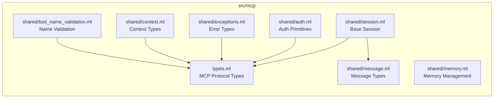
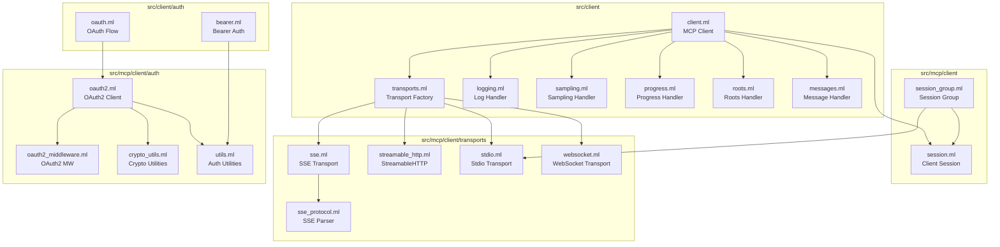
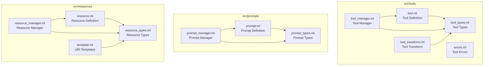
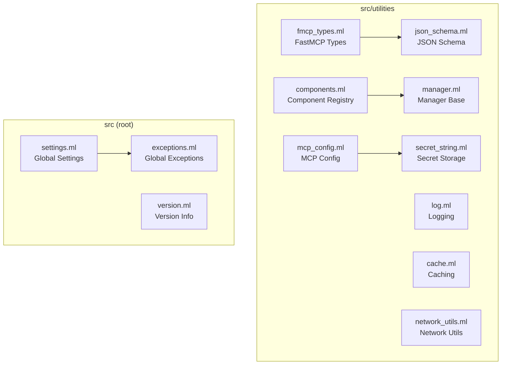
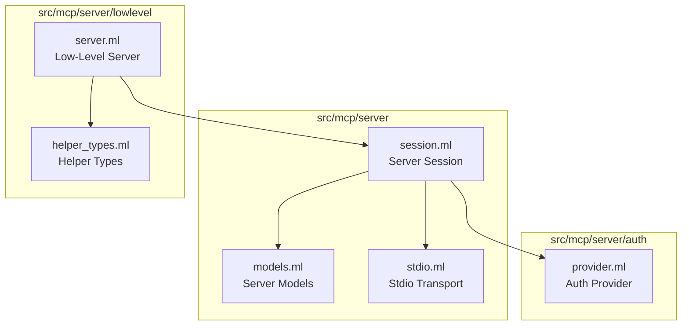
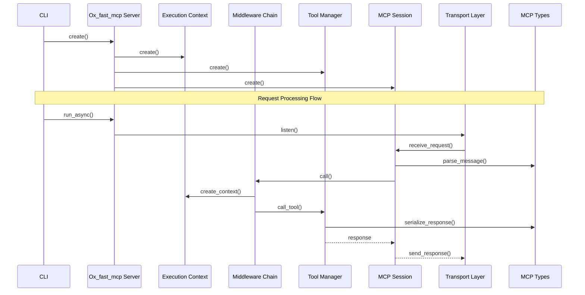
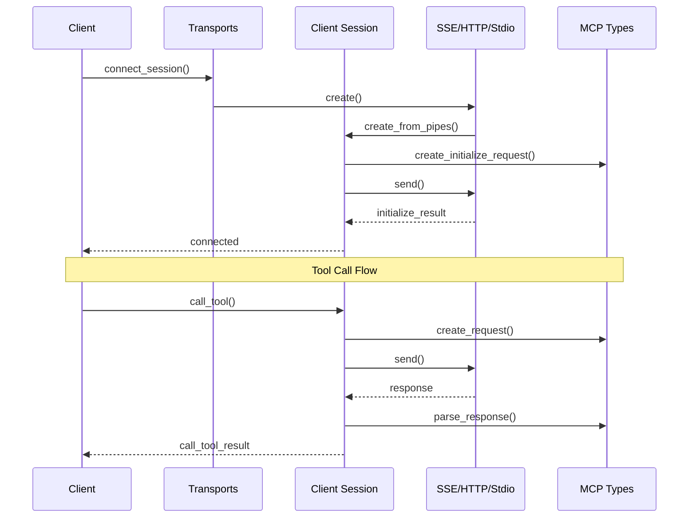
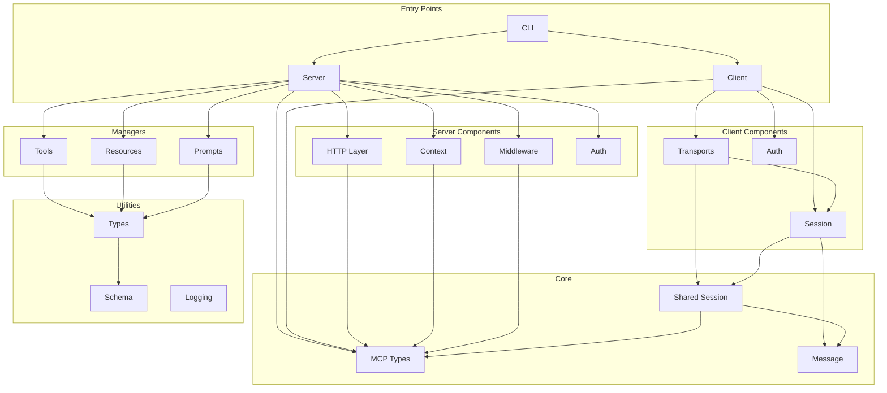

# OxFastMCP Component Architecture

This document describes the component architecture of OxFastMCP, an OCaml implementation of the Model Context Protocol (MCP).

## High-Level Architecture Overview

## Detailed Component Dependencies

### Core Type System

### Server Architecture

```mermaid
flowchart TB
    subgraph "src/server"
        Server["server.ml<br/>Main Server"]
        HTTP["http.ml<br/>HTTP/SSE App"]
        Context["context.ml<br/>Execution Context"]
        Proxy["proxy.ml<br/>Proxy Server"]
        Elicitation["elicitation.ml<br/>User Elicitation"]
        InputValidation["input_validation.ml<br/>Request Validation"]
        SessionBridge["session_bridge.ml<br/>Session Async Bridge"]
        StdioTransport["stdio_transport.ml<br/>Stdio Transport"]
        OpenAPI["openapi.ml<br/>OpenAPI Generation"]
        Dependencies["dependencies.ml<br/>Dependency Injection"]
        LowLevel["low_level.ml<br/>Low-Level API"]
    end

    subgraph "src/server/auth"
        ServerAuth["auth.ml<br/>Server Auth"]
        OAuthProxy["oauth_proxy.ml<br/>OAuth Proxy"]
        OIDCProxy["oidc_proxy.ml<br/>OIDC Proxy"]
        JwtIssuer["jwt_issuer.ml<br/>JWT Token Issuer"]
        AuthMiddleware["middleware.ml<br/>Auth Middleware"]
        RedirectValidation["redirect_validation.ml<br/>URI Validation"]
    end

    subgraph "src/server/middleware"
        Middleware["middleware.ml<br/>Core Middleware"]
        Caching["caching.ml<br/>Caching Layer"]
        ErrorHandling["error_handling.ml<br/>Error Handler"]
        RateLimiting["rate_limiting.ml<br/>Rate Limiter"]
        Timing["timing.ml<br/>Request Timing"]
        ToolInjection["tool_injection.ml<br/>Tool Injection"]
        MiddlewareLogging["middleware_logging.ml<br/>Logging Middleware"]
    end

    Server --> Context
    Server --> HTTP
    Server --> SessionBridge
    Server --> StdioTransport
    Server --> Middleware
    HTTP --> ServerAuth
    HTTP --> OAuthProxy
    Context --> Elicitation
    Context --> InputValidation
    Context --> SessionBridge
    Proxy --> Server
    Proxy --> Context
    OAuthProxy --> JwtIssuer
    OAuthProxy --> RedirectValidation
    OIDCProxy --> RedirectValidation
    ServerAuth --> AuthMiddleware
    Middleware --> ErrorHandling
    Middleware --> Caching
    Middleware --> RateLimiting
    Middleware --> Timing
    Middleware --> ToolInjection
    Middleware --> MiddlewareLogging
```

### Client Architecture

### Component Managers

### Utilities Layer

### MCP Server Session

## Complete System Call Flow

## Module Dependency Graph (Simplified)

## Directory Structure Summary

| Directory | Purpose | Key Modules |
|-----------|---------|-------------|
| `src/` | Root-level modules | `settings.ml`, `exceptions.ml`, `version.ml` |
| `src/cli/` | Command-line interface | `cli.ml` |
| `src/client/` | High-level MCP client | `client.ml`, `transports.ml` |
| `src/client/auth/` | Client authentication | `bearer.ml`, `oauth.ml` |
| `src/mcp/` | Core MCP protocol | `types.ml` |
| `src/mcp/client/` | Low-level client session | `session.ml`, `session_group.ml` |
| `src/mcp/client/transports/` | Transport implementations | `stdio.ml`, `sse.ml`, `streamable_http.ml`, `websocket.ml` |
| `src/mcp/client/auth/` | Client OAuth2 | `oauth2.ml`, `oauth2_middleware.ml` |
| `src/mcp/server/` | Low-level server session | `session.ml`, `stdio.ml` |
| `src/mcp/server/auth/` | Server auth provider | `provider.ml` |
| `src/mcp/server/lowlevel/` | Low-level server API | `server.ml` |
| `src/mcp/shared/` | Shared session primitives | `session.ml`, `message.ml`, `auth.ml`, `exceptions.ml` |
| `src/server/` | High-level FastMCP server | `server.ml`, `http.ml`, `context.ml`, `proxy.ml` |
| `src/server/auth/` | Server authentication | `oauth_proxy.ml`, `oidc_proxy.ml`, `jwt_issuer.ml` |
| `src/server/middleware/` | Server middleware | `middleware.ml`, `caching.ml`, `rate_limiting.ml` |
| `src/server/sampling/` | Server sampling | Sampling handlers |
| `src/tools/` | Tool management | `tool.ml`, `tool_manager.ml` |
| `src/prompts/` | Prompt management | `prompt.ml`, `prompt_manager.ml` |
| `src/resources/` | Resource management | `resource.ml`, `resource_manager.ml`, `template.ml` |
| `src/utilities/` | Shared utilities | `fmcp_types.ml`, `json_schema.ml`, `log.ml`, `cache.ml` |

## Key Design Patterns

1. **Layered Architecture**: Clear separation between high-level APIs (server/client) and low-level protocol implementation (mcp/)

2. **Manager Pattern**: Tools, Resources, and Prompts each have dedicated manager modules for registration, lookup, and execution

3. **Middleware Pipeline**: Server supports composable middleware for cross-cutting concerns (caching, rate limiting, logging, auth)

4. **Transport Abstraction**: Multiple transport protocols (Stdio, SSE, StreamableHTTP, WebSocket) behind a unified interface

5. **Session-based Communication**: Both client and server use session abstractions built on pipe-based message passing

6. **Type-Safe Protocol**: All MCP protocol messages use strongly-typed OCaml records with JSON serialization via `ppx_yojson_conv`

7. **Auth Header Wiring**: Bearer authentication automatically converted to HTTP headers via `auth_config_to_headers`

8. **Graceful Lifecycle Management**: Session groups implement proper shutdown (close stdin → SIGTERM → SIGKILL)

